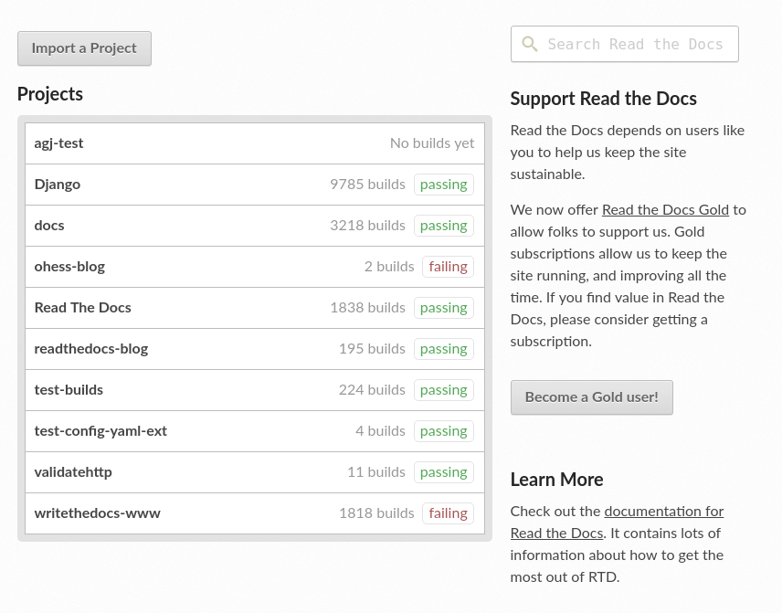
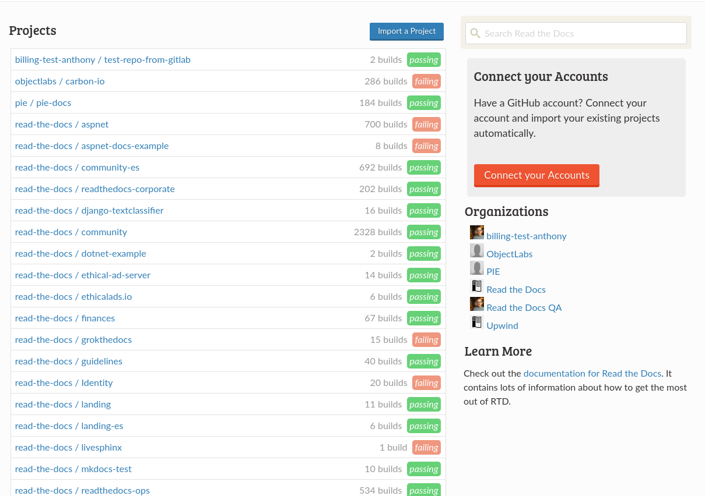
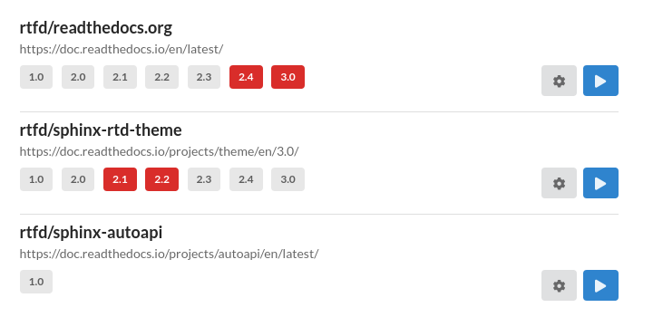
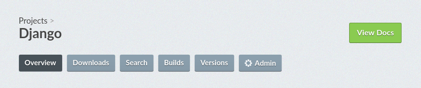
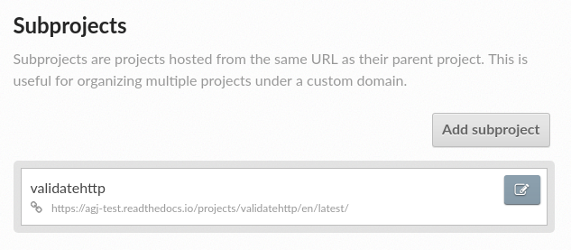
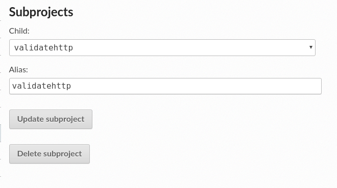

Phase I
=======

.. contents::
    :local:

Priorities
----------

* Reimplement our templates using SemanticUI. We have a partial implementation
  of this already
* Move from bower + gulp to webpack. We have a partial implementation of this
  already
* Start to move organization templates to community site
* Modularize common UI pieces, so that developers don't need to decide on how to
  create common UI patterns

Unpriorities
~~~~~~~~~~~~

Some of these work items will be addressed in a later phase or are not a
priority for us just yet.

* Redesigning the UX of pages that require either heavy attention to a UX
  overhaul or code changes to support well thought out UX. These are outlined in
  phase II :ref:`phase-ii-work`
* Giving distinct styling or polish to our existing marketing pages. For now
  we'll just port the pages to SUI. We'll cover polishing these pages in the
  next phase of work, see the phase II :ref:`phase-ii-work`.
* Establishing distinct style, colors, typography. We'll prioritize this work
  once we've ported to SUI and have an idea of where we can make visual
  improvements. We'll re-evaluate the need for a third phase of work when we get
  closer.
* Larger overhaul of UI structure. While there might be much better UX for a
  dashboard structure, we would rather start using SUI as soon as possible, and
  consider a larger overhaul later. We don't have the resources to consider
  restructuring the UI, as this could take a lot of code changes to accomplish.

Work items
----------

Use SemanticUI to overhaul our templates
~~~~~~~~~~~~~~~~~~~~~~~~~~~~~~~~~~~~~~~~

`This repository <https://github.com/rtfd/ext-theme>`_ is already a proof of concept
example showing how to implement a
tuned version of SUI that was installed via NPM. We can keep the size of SUI
down using this pattern.

For now, it might be helpful to keep work contained in a separate repository and
a separate Django application, so it's easy to make incremental updates and test
against both the community and commercial sites in a non-destructive manner.
Eventually, the SUI based templates will be the base templates found in our main
repository however.

UIs we won't change yet
```````````````````````

With several exceptions, we don't view our current design as sacred. We aren't
looking for a larger structural overhaul of our UI yet, but we are open to
recommendations for later stages of work. The following UIs will be ported to
using SUI for now, but we won't worry yet about altering the UX of these pages
yet:

* The UI pattern described in :ref:`modularize-common-ui` is the UI
  pattern we have been moving towards for all of our admin dashboard views.
  We'll keep this pattern as-is, using semanticui components instead, and expand
  it's usage on to all admin views.
* The `project import page <https://readthedocs.org/dashboard/import/>`_.
  We want to add fuzzy search to remote repositories,
  and make the organization sorting better. This will take some javascript code
  changes that shouldn't block the first phase of work.
* The build output page. This page will eventually have UI features like linking
  to a specific line number on the output and perhaps some UI to show the
  configuration file we executed with (replacing no-op commands like ``cat
  conf.py``).
* Marketing pages and landing pages like the `community home page <https://readthedocs.org>`_.
  These will be addressed with the next phase(s) of work. We will port to SUI
  for now, and will think more about polish of these pages in the following
  phases of work.

UIs we should address
`````````````````````

User dashboard view
+++++++++++++++++++

The `user dasboard view <https://readthedocs.org/dashboard/>`_
differs between the community site and our commercial site.



    The dashboard view for the community site. The sidebar has some
    onboarding blocks, and the search bar at the top of the page searchs
    *all* of Read the Docs.




    The dashboard view for the commercial site includes a list of
    organizations as well, but perhaps there is a better way to display this
    or link users to the organization detail pages.

The overall structure of this page is not super important to us, and we have
enough real estate to rethink how we're using the view. A couple notes/ideas here:

* The search bar isn't super important. Users are not landing on this page to
  do a global search of RTD, and reader users wouldn't see this UI as they need
  an account to see the dashboard view.
* The commercial site does a better job of making use of real estate for
  onboarding. We'd like to have more spots for onboarding eventually
* The empty list view should add an onboarding view to link to the project
  import page.

  .. figure:: img/project-list-example.png

        An example of an SUI empty list, see :ref:`example-list-onboarding` for
        the source

* The metadata on the listings isn't necessarily helpful and we could rethink
  how we are using this space:

    * The number of builds is not a useful number to users
    * The build status is either for the latest version or the most recent
      build. Build status is probably confusing or not useful for this reason

* Based on the context that users come to this page with, and how users use this
  page, some ideas about the most helpful UX for this page are:

    * Link each project to the project dashboard, and if we have a pattern for
      multiple buttons, a button that links directly into the project admin as
      well
    * Display a list of active versions in some fashion. Users are notified
      about a failure via email, and either link directly into the failing build
      from there, or might visit this dashboard page directly on notifications.
      Giving a quick way to visually scan failed versions would be helpful. List
      of versions could include build status of the version via visual hint.
      Perhaps on hover action displays more information on the failing build.
    * It might be a project for a second pass at this page, but the page
      currently doesn't give any visual indication to project hierarchy. For
      example, if I have a project that is set up as a superproject, the
      subprojects could visually nest underneath the main project -- similar for
      translation projects.
    * If we want to keep the UI simple, we should at least instead raise a warnings inside
      the listing: "Version ``latest`` has been failing for 13 builds", etc.




    A proof of concept that shows project versions and build status (red for failure) for
    each version. See :ref:`example-user-dashboard` for the source code

Project dashboard view
++++++++++++++++++++++

The project dashboard view is slowly changing and we will be refocusing
reader users to use in-documentation UI instead of ever interacting with the
project dashboard, which will become mostly a UI for project maintainers.

By consolidating some of the reader user features into in-documentation UI,
the scope of the project dashboard views can be reduced a good deal, as some
tabbed navigation buttons can be removed.



    The project dashboard header with existing tabbed navigation

Downloads
    These are already in-doc. It would maybe be useful to have links to these
    somewhere in the version listing, but this is not a common path for a
    maintainer user and would most likely pollute the version listing UI

Search
    This doesn't need to be a dedicated tab once we have a comparable in-doc
    search. We're a ways off on this, but at very least the tab should be a
    search box instead of a tabbed view

Versions
    We currently have 3 version listings. We'll go over these in more detail
    below, as it's a major point for some changes

The concept of builds is still a top-level concept in the project dashboard, as
this listing is useful UI. Also, the admin dashboard will still be a nested
construct under the project dashboard.

Here is an incomplete list of some of the problems of our project dashboard
views and UI:

Tabbed navigation is not useful as we move views around
    We have two level of navigation once you enter the admin dashboard -- a top
    level tabbed interface, and a vertical menu of the admin views. We'll want
    to keep the vertical menu, but perhaps if we're removing views from the
    tabbed navigation, we use this as a change to put everything into a singular
    vertical menu. This would clean up the interface greatly and give more room
    for helpful UI components around project configuration.

    .. figure:: img/project-dashboard-menu.png

        An example of a SUI vertical menu that has a collapsible Admin menu. See
        :ref:`example-menu` for the source.

The overview sidebar has unhelpful sections taking up space
    The sidebar has some useful information, but it is a bit of a dumping ground
    for project metadata. There are more thoughtful places to put some of this
    information, opening up the UI to be less cramped and put the focus on the
    important pieces in the project dashboard.

    .. figure:: img/project-dashboard-sidebar.png

        There isn't great information in this view right now, and it's cramping
        the overview version listing UI

    If the most helpful items could be moved to the project dashboard header,
    less helpful items from this list can be removed entirely. It would also
    probably help to make more decisions around how users are using the project
    metadata on this list. For instance slug isn't used directly, but is used in
    API requests, perhaps linking to our browsable API is a better UX?

We have 3 version listing pages that are all different
    There are currently 3 different version listing views:

    Project overview version listing
        This links to the documentation for each version, which is helpful but
        more of a reader feature, lists the version privacy (this is not the
        most helpful metadata we could include on the compact view on the
        project overview), and has an edit button that links to the edit form
        for the particular version.

    Project version listing
        This is the non-admin view of the version listing page, and is mostly
        the same as the overview version listing. It does include a commit hash
        on each version, which is helpful. It also lists all of the inactive
        versions in the same view as the active versions are displayed. Inactive
        versions is not helpful in this view and can cause timeouts or
        exceptions when the repository has a large number of versions.

    Project admin version listing
        The listing view of this UI is horrendous. The actual per-version forms
        are the UX that we will be moving towards, but really the project
        version listing should be moved to the admin version listing page to
        replace this current view. Ideally, this view does not list inactive
        versions either, but maybe allows users to add new active version from a
        dropdown of inactive versions.  The high number of inactive versions on
        this page is noise to the user, and frequently crashes this page for
        users as well.

        A form for activating an inactive version could pretty easily use SUI
        fuzzy search elements and could filter a list of inactive tags/branches,
        similar to the GitHub UI for selecting a branch/tag:

        .. figure:: img/github-fuzzy-search.png

            GitHub UI for fuzzy search on branch and tag names. We have a list
            of branch/tags that we could use to populate a dropdown form field.

    There is much more useful metadata that we're missing from the version
    listing pages as well -- build status(!), last build date(!), which version
    is the default version, and which version is ``latest``.

    If we want to keep the overview page version listing, the underlying
    template could be a shared view with the admin listing view. Perhaps on the
    overview listing page we don't need all of the metadata that you'd find in
    the admin version listing page. The project version listing page can go away
    completely, as it will replace the admin dashboard view of versions.

Project dashboard admin views
+++++++++++++++++++++++++++++

The main goal here is to remove the legacy one-off list view and form views and
replace with the same consistent pattern. The pattern we'll move towards is
covered below, in :ref:`modularize-common-ui`, but breifly, this means:

* List view has a button that leads to a create form
* List view has an empty listing view with some onboarding

  .. figure:: img/project-list-example.png

        An example of an SUI empty list, see :ref:`example-list-onboarding` for
        the source

* List view utilizes a multiline list view if there is any helpful metadata to
  post on the list view for each item
* There is a button that leads to the edit form view in each listing
* There is no form on the same page as the list view -- this duplicates the form
  view needlessly

Other technical considerations
``````````````````````````````

* Template changes will affect our community site and our commercial site, we
  should be periodically be testing against the lastest versions of both
* It might be cleaner to structure the templates in a way so that we can
  eventually move then into per-application paths, and keep all the relevant
  templates isolated in Django applications so they are easier to find. We do
  have some overrides of external templates that we'll still need a global
  templates path for, but if the templates are at least strutured to correspond
  with our application structure, we can make the decision to move to
  per-application paths later.

Move to webpack build for CSS
~~~~~~~~~~~~~~~~~~~~~~~~~~~~~

`This repository <https://github.com/rtfd/ext-theme>`_
also includes an example of building static assets for SUI using Webpack.
We'll have to also do testing of building JavaScript assets separately,
as this could be a large breaking change if not well tested.

.. note::
    The Webpack configuration was a proof of concept and might be slightly stale
    or broken. Hopefully it provides a starting point however.

Add organization templates and structure into community site
~~~~~~~~~~~~~~~~~~~~~~~~~~~~~~~~~~~~~~~~~~~~~~~~~~~~~~~~~~~~

One of our planned pieces of work for the next few months is moving the
organization implementation from our commercial hosting into our community
hosting. So this should be considered as we are overhauling our templates.

Depending on how we decide to implement the changes, organizaitons will likely
either be a non-used feature on the community site to start, or will be an
optional component of the UI structure and design. The main templates that need
to take this into consideration are the project dashboard templates, as these
might optionally show organization ownership as part of the project nesting.

The templates for all of our organization and organization team management are
located in our private commerical code. They should be copied into our community
templates eventually, and so can exist in this project, separate from our
commercial implementation.

On the community site, our current pattern is:

* Projects are top level components
* Projects are tied to multiple user accounts
* The project lives at a unique slug -- `requests` for example

On the commercial site:

* Projects are nested under organizations
* Projects aren't tied to multiple user accounts directly. Instead the project
  references a project through the use of an organization team
* Projects live at a unique slug, prepended with the organization slug --
  `rtfd-readthedocs-org` for example. Many users use their own domains and this
  slug doesn't matter to users.

We haven't decided exactly how organizations will be used on the community
site yet. The implementation will have to be a mix between our two current
implementations, allowing for both projects owned by users and projects owned by
organization teams.

For now, it's probably best to repurpose the templates that exist on the
commercial site. For pages like the project dashboard page, the community site
might need optional UI pieces to display the project nesting under an
organization.

.. _modularize-common-ui:

Modularize common UI pieces
~~~~~~~~~~~~~~~~~~~~~~~~~~~

Instead of reimplementing the same HTML templates for similar CRUD interfaces, a
modular common template for most of our dashboard UI could be used as a base
instead. This would remove the need for developers to make decisions about
how to implement a particular UI.

For example, a common pattern we're moving towards in our admin dashboard looks
like this:



    Example of a model list view

The UIs that use this pattern currently follow these rules:

* List view has a button that leads to a create form
* List view has an empty listing view with some onboarding

  .. figure:: img/project-list-example.png

        An example of an SUI empty list, see :ref:`example-list-onboarding` for
        the source

* List view utilizes a multiline list view if there is any helpful metadata to
  post on the list view for each item
* There is a button that leads to the edit form view in each listing. The button
  is an icon to work around localization issues with long text
* There aren't multiple buttons on each item. This isn't import if we can make
  multiple icon buttons work consistently, and one of the buttons is the obvious
  default action button.
* There is no form on the same page as the list view -- this duplicates the form
  view needlessly

Tabular data on these list views is too cramped with the addition of most of our
metadata. We also don't have many lists that would benefit from bulk actions,
but this could be a pattern introduced later when we want to take on the code
changes to support this.



    An example of a model edit form for an admin dashboard item

We hope to have a common set of templates that we can either reference directly
in the Django view, or can extend using Django template inheritance. Instead of
reimplementing the HTML each set of admin templates, we'd be able to override
only the pieces that differ from the common templates. This will probably
require the use of template macros or perhaps code changes to add more template
context data.
