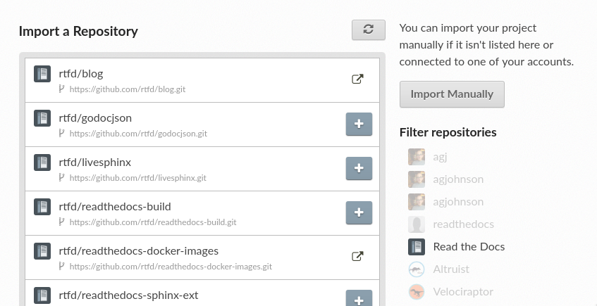
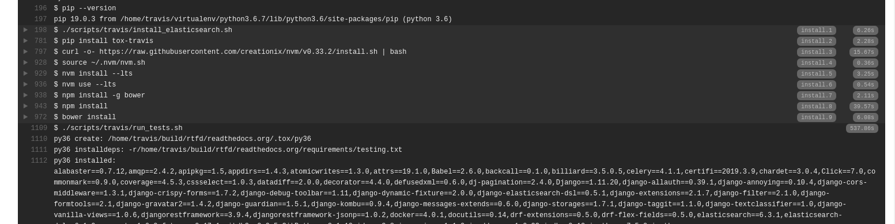

Phase II
========

.. contents::
    :local:

Priorities
----------

This phase addresses some of the polish work that we put off to get a first
implementation of using SUI released. We'll address some of our tougher UX and
make some attractive marketing pages at this point.

.. _phase-ii-work:

Work items
----------

* Improve the UX of several pages with difficult UX, or pages that require
  heavier code changes
* Start to put polish on marketing page by making more thoughtful designs and
  introducing more graphical elements.

Better UX
~~~~~~~~~

Several UIs will be left out of our :doc:`phase-i` plans and will be focused on
later, when we can coordinate more resources to development around the UI
changes.

Project import
``````````````



    The project import list view if you have a connected account with GitHub
    or Bitbucket.

We'd like this page to implement a fuzzy text search on repository name.
Pagination can either be replaced, or if it compliments fuzzy search, it can 
stay without issue. Currently, pagination is a bad UX if you have a large number
of repositories or organizations.

Some things this page should do:

* Fuzzy filter the list -- SUI probably assumes we're loading the entire list of
  repository names into the page ouptut on render. Another direction to go with
  this would be to customize a query for fuzzy matches against the
  RemoteRepository table
* Better display of organizations -- there is no clear designation between
  GitHub/Bitbucket/GitLab organizations
* Currently, the remote repository list gets out of sync unless you take the
  manual refresh option at the top of the page. This seems like bad UX. We also
  might not be removing repositories from this list when they are removed from
  GitHub/etc. We could look into some code changes to update user repositories
  on load, in which case we'd want to show elements as visually loading while
  waiting on information back from GitHub/GitLab/Bitbucket APIs.

Build detail page
`````````````````

* The styles to hide scrollbars negatively affect display on Firefox. The
  command should be truncated or whatever we need to do to make this work across
  browsers. Scrolling the single line is bad UX as well, it's hard to copy.
* Users should be able to link to specific lines, similar to GitHub's file view.
  Or at very least link into a command section.
* We should replace the no-op ``cat conf.py`` with a UI that shows the config
  file options the build was executed with instead.

  .. figure:: img/circleci-build-config.png

      Travis and CircleCI both have build configuration tabs that show the
      configuration that was used in the build process

* Suggestions should have a unique style, and are hopefully more visually linked
  to the error messages that caused the suggestion. Currently, the two can seem
  unrelated
* As the command results come back from the API, any section that was currently
  open closes as Knockout refreshes the underlying list. This is perhaps minor
  and normal users wouldn't watch a build progress like this. It might be a
  helpful bug to squash

  .. figure:: img/build-output-errors.png

    An example of a suggestion and an error message on our commercial hosting

The Travis job output UI has some of the patterns we're talking about: line
wrapping in a better way, linkable line numbers, and some of the output is
easily searchable.



    An example job output page in Travis

Improved marketing pages
~~~~~~~~~~~~~~~~~~~~~~~~

Our marketing pages are a lot nicer then they used to be, but with with SUI and
some nicer patterns from the framework, it would be nice to have attractive
marketing pages. Some of the pages we'll be focusing on at this point if we
haven't ported the pages already:

* Community landing page

  * Highlights what Read the Docs does
  * Points to some existing projects
  * Has some testimonials or case studies?
  * Global RTD search is maybe optional. It does at least show off projects on
    Read the Docs, but I don't think it's useful for anyone

* Commercial landing page

  * Highlights what Read the Docs does, and also highlights the commercial
    hosting features that are different from community
  * Has testimonials or case studies
  * Maybe has plan information on front page

* Commercial pricing page
* Community features page
* Commercial features page

The community and commercial landing pages are good candidates to utilize more
thoughtful design and start to apply some more graphical elements to these
pages. 
